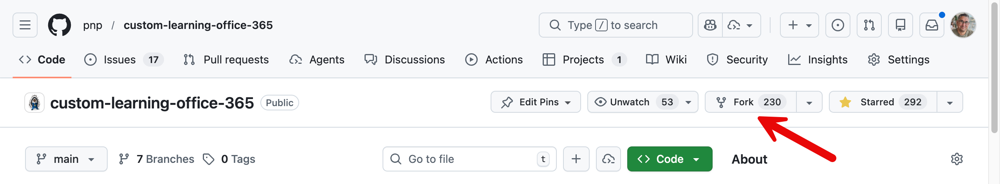
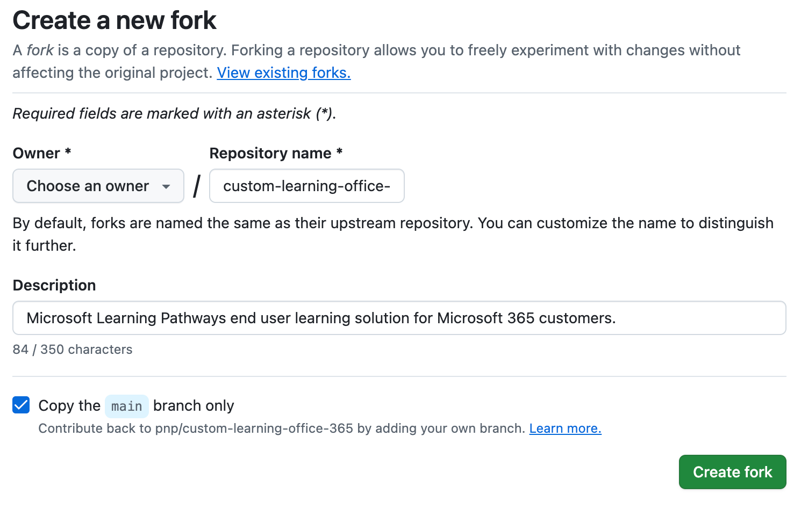
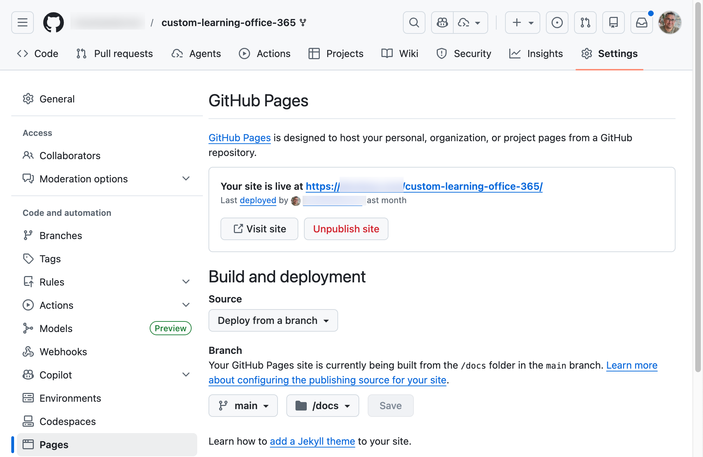
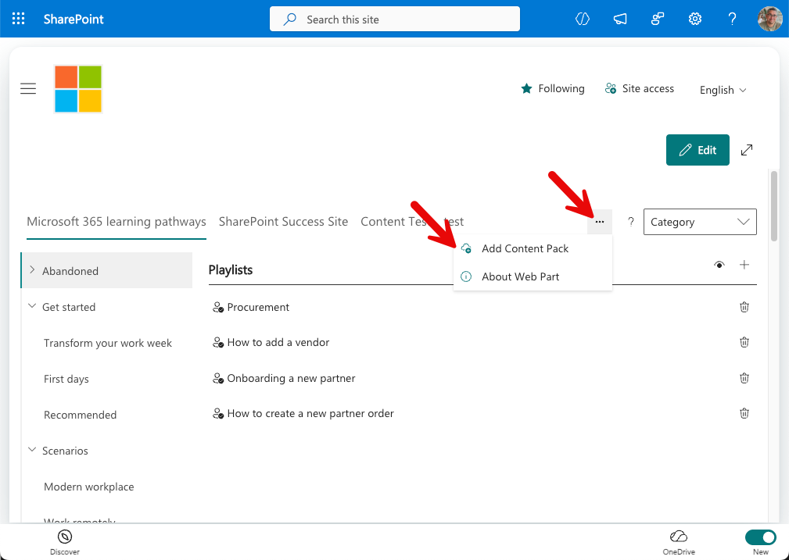
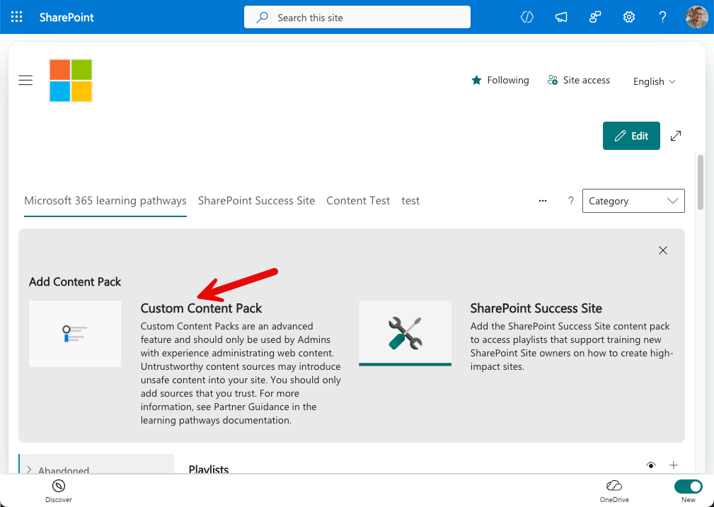
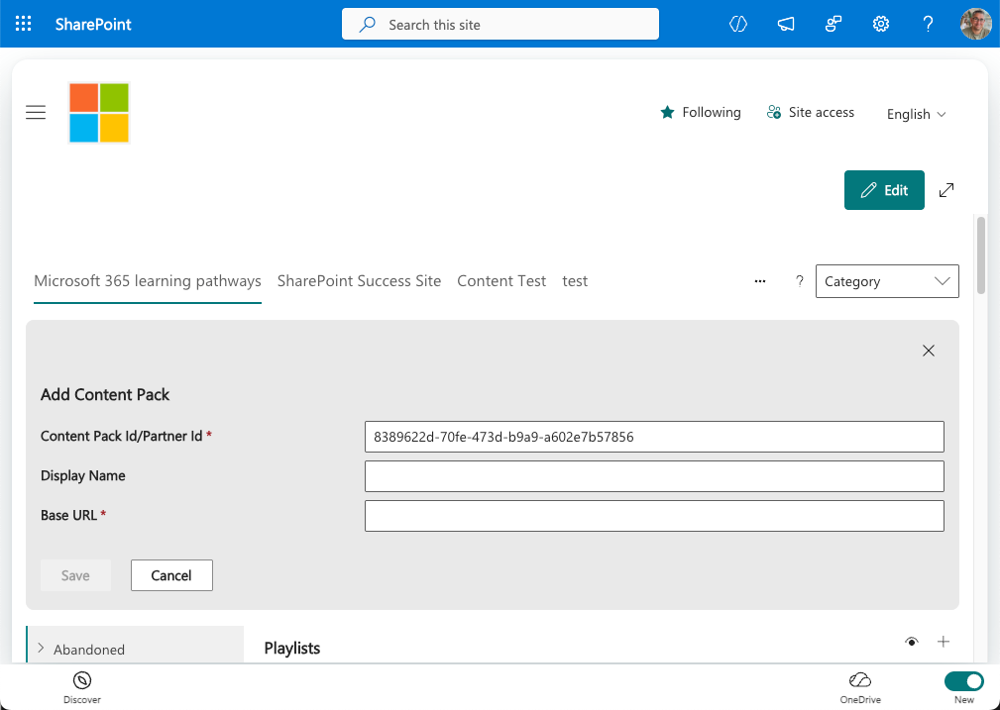

# Create a custom content pack

This guide explains how to create a Custom Content Pack for Microsoft 365 Learning Pathways. A custom content pack allows you to create a list list of categories or sub-categories for your organization. It allows you to add custom metadata and tag your content to your need. You can use this in conjunction with the out of the box content pack or replace the out of the box content. Emily Mancini provides a great step by step video for [creating your custom content pack](https://www.youtube.com/watch?v=dzqEI5NKQ2U).

## Prerequisites
- A provisioned Microsoft 365 learning pathways site (v4.0 or later).
- Administrator access to the Learning Pathways Administration page.
- A github account with the ability to create a public respository

## How content packs work
- Learning Pathways reads three JSON manifest files hosted on a CDN (metadata.json, playlists.json, assets.json) plus an images folder.
- The solution merges these manifests with the tenant's local custom content. The viewer web part caches manifests for up to 24 hours; the admin web part can force-refresh the cache.
- Content packs are added by configuring a CDN base URL in the Learning Pathways administration UI.

## Steps for creating a custom content pack
1. Fork the Microsoft 365 Learning Pathways Repository
2. Enable GitHub Pages
3. Add GitHub pages URL as a custom content pack in Learning Pathways
4. Edit custom metadata in content pack
5. Refresh view in Microsoft 365 Learning Pathways

### Forking the Microsoft 365 Learning Pathways Repository
The easiest way to create a custom content pack is to fork the existing Microsoft 365 Learning Pathways repository.

- Navigate to the (Microsoft 365 Learning Pathways repository)[https://github.com/pnp/custom-learning-office-365]
- Select "Fork" from the repository main page  

- On the Create Fork page select the owner (should be you or your organization) and if desired change the name of the repository.  

- Click Create Fork.

This will create a new fork (or a personal copy) of the Microsoft 365 Learning Pathways content in your GitHub repository.

### Enable GitHub Pages
Microsoft 365 Learning Pathways content is served using GitHub Pages. Before you can use your custom content pack you will need to enable GitHub Pages.

- Navigate to the settings page in your newly forked repository
- Select Pages
- Under Source select the branch you want to use, recomended to use Main
- In the folder icon select /docs
- Select Save
- When the page refreshes there will be an indicator that says your site is live at... Copy the URL and save it. This will be the URL to your custom content pack.



### Add GitHub pages URL as a custom content pack in Learning Pathways
- Navigate to the Learning Pathways Administration page ```https://<YourTenantName>.sharepoint.com/sites/<YourLPSite>/SitePages/CustomLearningAdmin.aspx```  
- In the tool bar click the elipsis next to the Category menu and select add content pack  

- On the next screen select Custom Content Pack  

- Enter a descriptive name for your new content pack
- Enter the GitHub Pages URL from the previous step in the Base URL field. ** This url only points to the root of the docs folder so you need to add /learningpathways/ to the end of the url.** It should look something like this ```https://<MyGitHubUrl.GitHub.io>/Custom-learning-office-365/learningpathways``` keeping in mind that ```<MyGitHubUrl>``` would be your GitHub user name or a custom domain name depending on how your GitHub is configured and Custom-learning-office365 is the name of the repository you created when you forked the repository.   

- Click Save
- The custom content tab will be added to the top of the administration web part

### Edit custom metadata in content pack
You can edit the content directly in the GitHub web interface or you can clone the repo to your desktop and edit using a tool like Visual Studio Code. These instructions will show how to edit using the GitHub web interface. There are three files that make up Microsoft 365 Learning Pathways content.

#### Related JSON file and function
- `metadata.json` — navigation, categories, technologies, content pack entries, site/app telemetry and version info.
- `playlists.json` — playlist metadata and ordered list of asset GUIDs.
- `assets.json` — individual asset entries with URLs the web part will iframe.

Depending on the type of change you want to make will depend on the file you need to edit. If you want to control the high level categories that is found in the metadata.json file. For details on the [JSON Schema review the schema documentation](JSONSchema.md). 

1. Navigate to your repository.
2. Click on the Code tab.
3. In the list of folder select docs > learning pathways > V4
4. Depending on what language you are using navigate to the correct folder (e.g. English is in the en-us folder). Note that any changes made will only be reflected in the language you are editing. So if you edit a file in the en-us folder it will not be reflected in the Spanish folder.
5. Edit any files in the GitHub user interface and commit the change.

### Refresh view in Microsoft 365 Learning Pathways
Now that you have published your changes to your custom content pack in GitHub you can test this in Microsoft 365 Learning Pathways. 

- Navigate to the Learning Pathways Administration page ```https://<YourTenantName>.sharepoint.com/sites/<YourLPSite>/SitePages/CustomLearningAdmin.aspx``` 
- Ensure you do a hard refresh of the browser to clear the cache. 
- Select the tab at the top that is the name you created for your custom content pack. 
- You should see your changes reflected.
